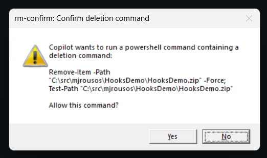

# guardrails plugin for GitHub Copilot CLI

A bundle of [`preToolUse`][hooks-docs] hooks that constrain Copilot CLI
behavior. Two guardrails are included today; the layout is intended to
grow as more are added.

[hooks-docs]: https://docs.github.com/en/copilot/how-tos/copilot-cli/customize-copilot/use-hooks

## Hooks in this plugin

| Hook | Trigger | Behavior |
| --- | --- | --- |
| **URL allowlist** (`url-allowlist.{sh,ps1}`) | Tool calls whose arguments reference an `http(s)://…` URL — `web_fetch`, `fetch`, `http_get`, `url_fetch`, `web_search`, and `bash` / `shell` / `powershell` commands invoking `curl` / `wget` / `Invoke-WebRequest` / `Invoke-RestMethod` / `iwr` / `irm`. | Denies the call when any URL's host is not in `allowed-domains.txt`. Allowed (or unrelated) calls produce no output and exit 0. |
| **rm-confirm** (`rm-confirm.{sh,ps1}`) | `bash` / `shell` / `powershell` tool calls whose `command` matches `\b(rm\|rmdir\|del\|erase\|ri\|Remove-Item\|Remove-ItemProperty)\b` (case-insensitive). | Interactively prompts the user before allowing the call. Bash opens `/dev/tty` for a `[y/N]` prompt; PowerShell pops a `System.Windows.Forms.MessageBox`. On **No** (or any non-`y` answer / closed dialog) the call is denied. Fails closed if no TTY / no interactive desktop is available. |

Both hooks run regardless of Copilot's permission mode, so the rm
confirmation prompt fires **even in YOLO / auto-approve mode**.

## Layout

```
plugins/guardrails/
├── plugin.json
├── hooks.json              # registers both preToolUse hooks
├── allowed-domains.txt     # one domain per line; # comments allowed
└── scripts/
    ├── url-allowlist.sh    # Bash URL allowlist (needs jq)
    ├── url-allowlist.ps1   # PowerShell URL allowlist
    ├── rm-confirm.sh       # Bash rm prompt (TTY; needs jq)
    └── rm-confirm.ps1      # PowerShell rm prompt (Windows Forms dialog)
```

## How the hooks see tool calls

For every tool invocation Copilot CLI runs each registered hook with a
JSON payload on stdin like:

```json
{
  "timestamp": 1704614600000,
  "cwd": "/path/to/project",
  "toolName": "web_fetch",
  "toolArgs": "{\"url\":\"https://example.com/foo\"}"
}
```

A hook denies the call by writing a single-line JSON object to stdout
and exiting 0:

```json
{"permissionDecision":"deny","permissionDecisionReason":"…"}
```

Per the [hooks reference][hooks-config], only `deny` is currently
honored, so allowed calls simply exit 0 with no output.

[hooks-config]: https://docs.github.com/en/copilot/reference/hooks-configuration

## URL allowlist details

The script:

1. Returns immediately for tool calls that have nothing to do with URLs.
2. For URL-fetching tools (`web_fetch`, `fetch`, `http_get`,
   `url_fetch`) it pulls the `url` argument directly.
3. For `web_search` it scans the raw arguments for `http(s)://…` URLs.
4. For shell tools (`bash`, `shell`, `powershell`) it scans the command
   for `curl` / `wget` / `Invoke-WebRequest` / `Invoke-RestMethod` /
   `iwr` / `irm` and extracts every `http(s)://…` URL.
5. Each URL's host is compared to `allowed-domains.txt`. A host matches
   an entry if it is exactly equal **or** ends with `.<entry>` — so
   `github.com` allows `api.github.com` but not `evilgithub.com`.
6. The first non-matching URL produces a deny response.

### Editing the allowlist

Edit `allowed-domains.txt`. One domain per line, blank lines and `#`
comments are ignored. Changes take effect on the next tool call — no
restart required.

## rm-confirm details

The script:

1. Returns immediately for tool calls that are not `bash`, `shell`, or
   `powershell`.
2. Parses the `command` argument out of `toolArgs` and matches it
   against
   `\b(rm|rmdir|del|erase|ri|Remove-Item|Remove-ItemProperty)\b`
   (case-insensitive). Word boundaries prevent false positives like
   `warm` → `rm` or `delete` → `del`.
3. Prompts the user — TTY on Unix, MessageBox on Windows.
4. On **Yes**, exits 0 (Copilot runs the command).
5. On **No** / any other answer / closed dialog, emits a deny payload
   that tells the agent *not to retry without re-asking the user*.

### Fail-closed behavior

If the hook is invoked in a non-interactive context (no `/dev/tty`, no
desktop session for the MessageBox, or `jq` is missing in the bash
branch), it **denies the call** rather than allowing it. An `rm` should
never slip through unconfirmed.

### Timeout

The hook is registered with `"timeoutSec": 300` (5 minutes) so the user
has time to read the command and decide. Increase this in `hooks.json`
if you commonly need longer.

### Demo Screenshots


This dialog appears when a PowerShell command attempts to delete something.

## Installing

From the repository root:

```sh
copilot plugin install ./plugins/guardrails
copilot plugin list
```

Re-run `copilot plugin install ./plugins/guardrails` whenever you change
a file in this plugin — the CLI caches plugin contents and only
refreshes on install.

To uninstall:

```sh
copilot plugin uninstall guardrails
```

## Testing locally

Pipe sample payloads into a script and check the exit code / output.

### URL allowlist

Bash:

```bash
# allowed
echo '{"toolName":"web_fetch","toolArgs":"{\"url\":\"https://docs.github.com/en\"}"}' \
  | ./plugins/guardrails/scripts/url-allowlist.sh
echo "exit=$?"

# blocked
echo '{"toolName":"web_fetch","toolArgs":"{\"url\":\"https://example.com/\"}"}' \
  | ./plugins/guardrails/scripts/url-allowlist.sh

# unrelated tool — no output, exit 0
echo '{"toolName":"edit","toolArgs":"{\"path\":\"src/app.ts\"}"}' \
  | ./plugins/guardrails/scripts/url-allowlist.sh
```

PowerShell:

```powershell
'{"toolName":"web_fetch","toolArgs":"{\"url\":\"https://docs.github.com/en\"}"}' `
  | pwsh -File .\plugins\guardrails\scripts\url-allowlist.ps1

'{"toolName":"web_fetch","toolArgs":"{\"url\":\"https://example.com/\"}"}' `
  | pwsh -File .\plugins\guardrails\scripts\url-allowlist.ps1

'{"toolName":"bash","toolArgs":"{\"command\":\"curl https://evil.test/x\"}"}' `
  | pwsh -File .\plugins\guardrails\scripts\url-allowlist.ps1
```

### rm-confirm

Bash:

```bash
# Triggers the prompt — answer y or N at the TTY
echo '{"toolName":"bash","toolArgs":"{\"command\":\"rm -rf /tmp/junk\"}"}' \
  | ./plugins/guardrails/scripts/rm-confirm.sh

# Not a deletion — exit 0, no output
echo '{"toolName":"bash","toolArgs":"{\"command\":\"ls -la\"}"}' \
  | ./plugins/guardrails/scripts/rm-confirm.sh

# Word-boundary check: "warm" must NOT trigger
echo '{"toolName":"bash","toolArgs":"{\"command\":\"echo warm\"}"}' \
  | ./plugins/guardrails/scripts/rm-confirm.sh
```

PowerShell:

```powershell
# Triggers the MessageBox
'{"toolName":"powershell","toolArgs":"{\"command\":\"Remove-Item -Recurse -Force C:\\temp\\junk\"}"}' `
  | pwsh -File .\plugins\guardrails\scripts\rm-confirm.ps1

# Triggers via the `del` alias
'{"toolName":"powershell","toolArgs":"{\"command\":\"del foo.txt\"}"}' `
  | pwsh -File .\plugins\guardrails\scripts\rm-confirm.ps1

# Not a deletion — exit 0, no output
'{"toolName":"bash","toolArgs":"{\"command\":\"git status\"}"}' `
  | pwsh -File .\plugins\guardrails\scripts\rm-confirm.ps1
```

## Testing with Copilot agent

After installing the plugin you can exercise both hooks live:

- **URL allowlist** — asking Copilot to summarize key points from
  https://docs.github.com/en/copilot/how-tos/copilot-cli/customize-copilot/plugins-creating
  should succeed; asking it to summarize key points from
  https://en.wikipedia.org/wiki/GitHub should fail.
- **rm-confirm** — ask Copilot to *"delete the dist folder"*. You should
  see the confirmation prompt appear (TTY on Unix, MessageBox on
  Windows) before the command runs, even in YOLO mode. Click **No** /
  answer `n` and Copilot will report that the deletion was blocked.

## Extending

- **Logging.** Append each decision to a JSONL log inside the script,
  e.g. `Add-Content .github/hooks/logs/audit.jsonl …`. Add
  `.github/hooks/logs/` to `.gitignore`.
- **Per-tool rules.** Extend the URL hook's `switch`/`case` block to
  recognize additional tool names your environment exposes.
- **Stricter URL parsing.** Replace the regex URL extraction in the
  shell branch with a dedicated parser if you need to handle exotic
  command lines.
- **Tighten the rm trigger.** Replace the regex with one that requires a
  recognizably destructive flag (e.g. `rm\s+(-[a-z]*r|--recursive)`) to
  reduce confirmation fatigue.
- **Broaden the rm trigger.** Add patterns for other destructive
  operations you care about — `dd`, `mkfs`, `shred`, `:>`, `truncate`,
  `git push --force`, etc.
- **Allowlist paths.** Permit deletions inside known-safe directories
  (e.g. `dist/`, `node_modules/`, `bin/`, `obj/`) without prompting,
  while still gating everything else.
